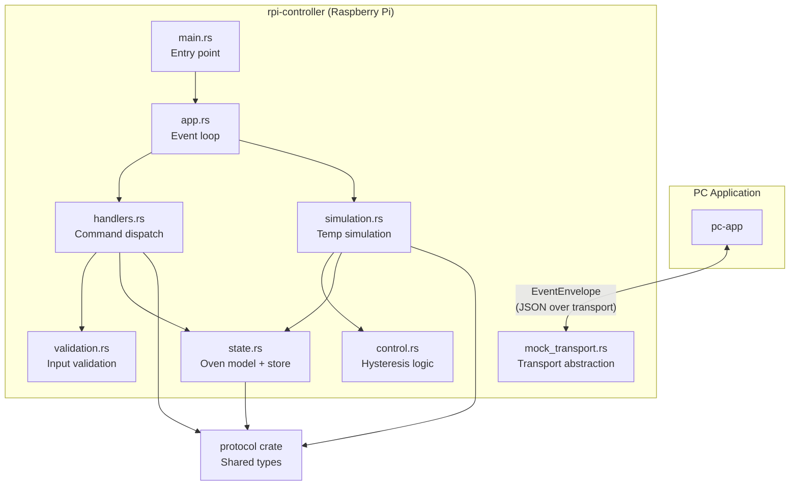
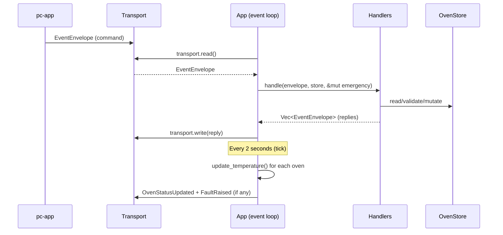
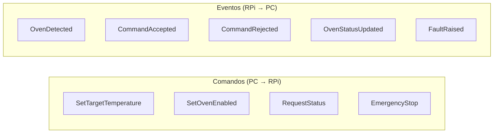
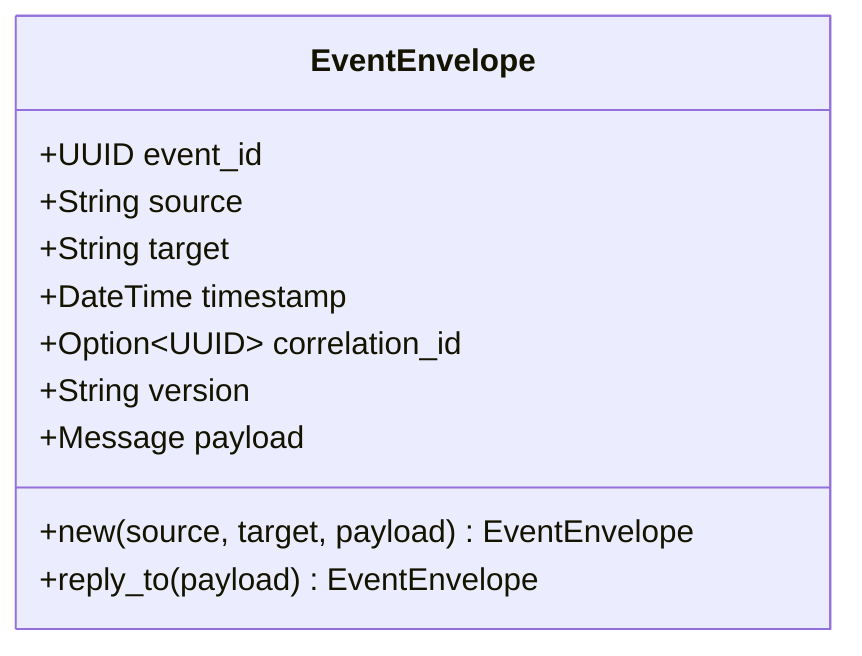
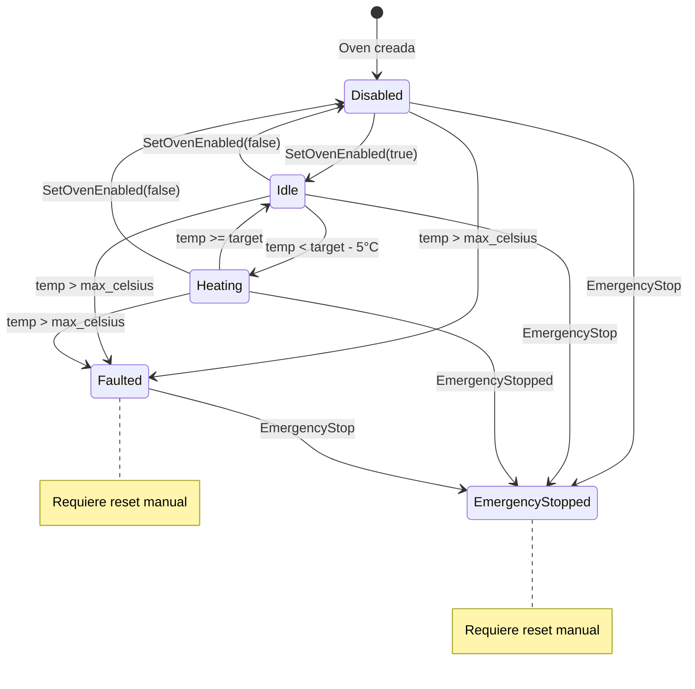
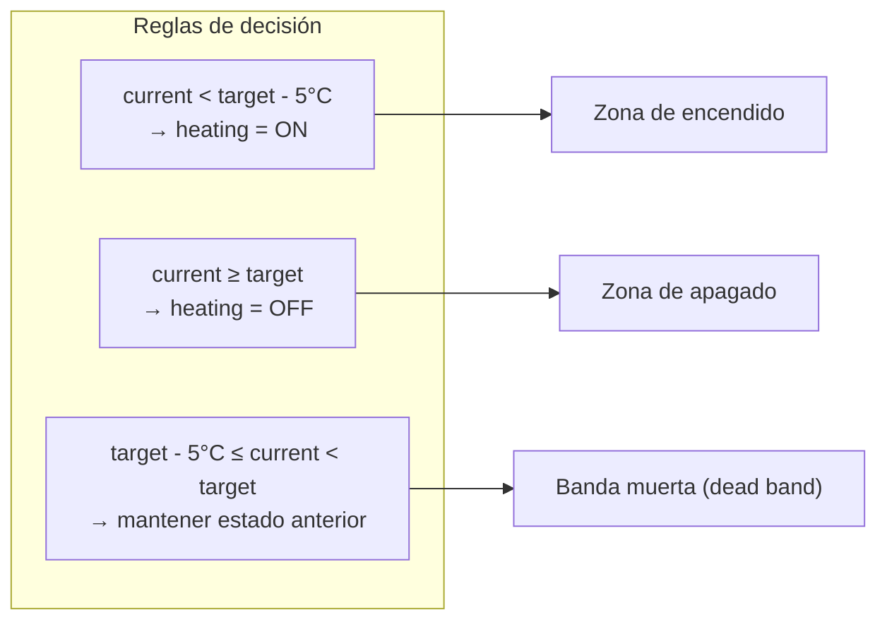
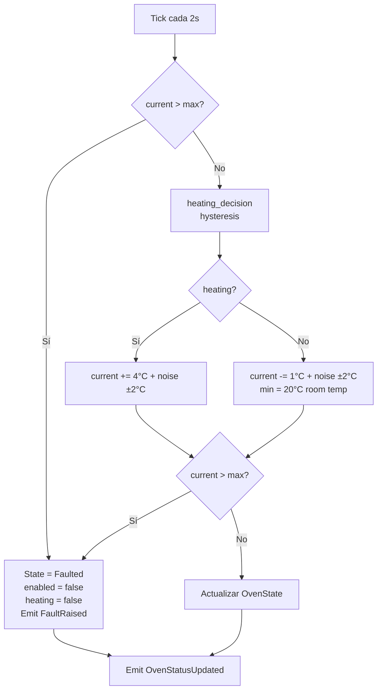
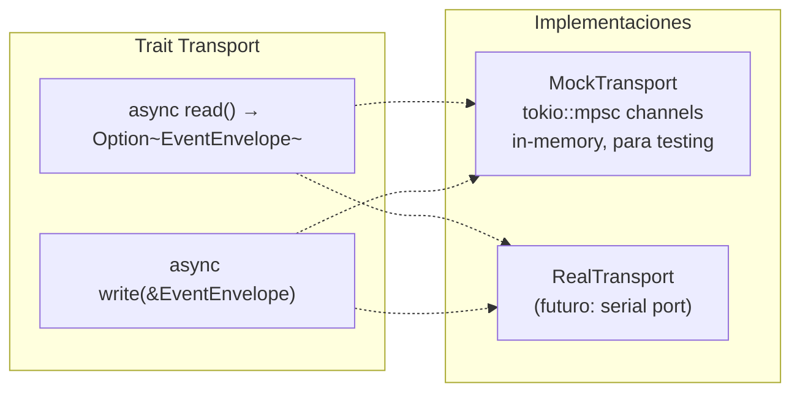
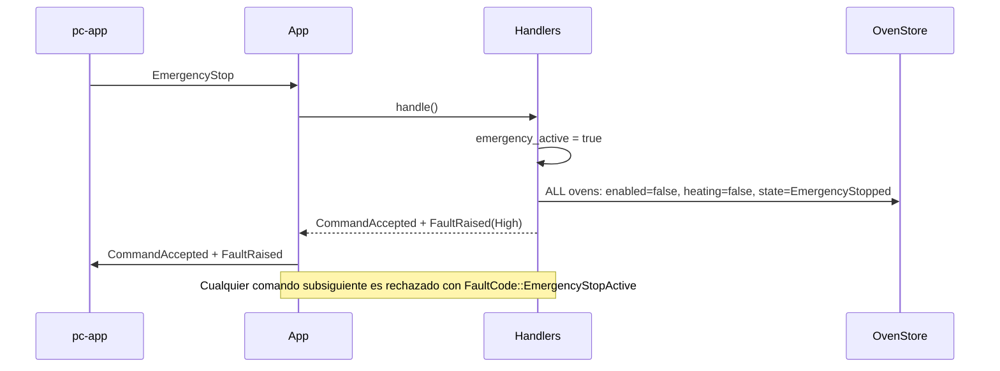

# rpi-controller — Arquitectura

Controlador de hornos industriales simulado que corre en Raspberry Pi. Se comunica con una aplicación PC mediante un protocolo de eventos basado en JSON.

## Visión general



## Flujo de datos principal



## Protocolo de comunicación

El crate `protocol` define tipos compartidos serializados como JSON con tagging externo: `{"type": "VariantName", "payload": {...}}`.



Cada mensaje se envuelve en un `EventEnvelope` con metadatos:



`reply_to()` invierte source/target y guarda el `event_id` original como `correlation_id`.

## Máquina de estados del horno



## Control de histéresis

El calentador usa una banda de histéresis de **5°C** (ADR 002) para evitar ciclos rápidos on/off:



Ejemplo con target = 150°C:

| Temperatura actual | Estado heating |
|---|---|
| < 145°C | ON |
| 145°C – 149.9°C | Mantiene el anterior |
| ≥ 150°C | OFF |

## Simulación de temperatura

Cada tick (2 segundos) actualiza la temperatura de todos los hornos:



Constantes de simulación:

| Constante | Valor | Unidad |
|---|---|---|
| HEATING_DRIFT | 4.0 | °C/tick al calentar |
| COOLING_DRIFT | 1.0 | °C/tick al enfriar |
| ROOM_TEMP | 20.0 | °C mínimo absoluto |
| NOISE_AMPLITUDE | ±2.0 | °C ruido aleatorio |
| HYSTERESIS | 5.0 | °C banda muerta |
| TICK_INTERVAL | 2 | segundos entre ticks |

## Transporte



`MockTransport::channel()` crea un par conectado A↔B. Lo que A escribe, B lo lee y viceversa. Esto permite tests end-to-end sin hardware.

## Estructura de módulos

| Módulo | Responsabilidad |
|---|---|
| `main.rs` | Parseo de `--simulate N`, creación de App, event loop |
| `app.rs` | Orquestador: `tokio::select!` multiplexa comandos entrantes + ticks de simulación |
| `handlers.rs` | Dispatch de comandos → validación → mutación de estado → generación de eventos respuesta |
| `validation.rs` | Validación pura de comandos (rango de temperatura, estado del horno, emergency stop) |
| `control.rs` | Lógica de histéresis para decidir si el calentador está ON u OFF |
| `simulation.rs` | Simulación de temperatura: drift, ruido, límites de seguridad |
| `state.rs` | Modelo de dominio (`Oven`) y store thread-safe (`OvenStore = Arc<RwLock<HashMap>>`) |
| `mock_transport.rs` | Abstracción `Transport` + implementación mock con canales |

## Manejo de EmergencyStop



## Ejecución

```bash
# Sin hornos simulados
cargo run

# Con 3 hornos simulados
cargo run -- --simulate 3
```
