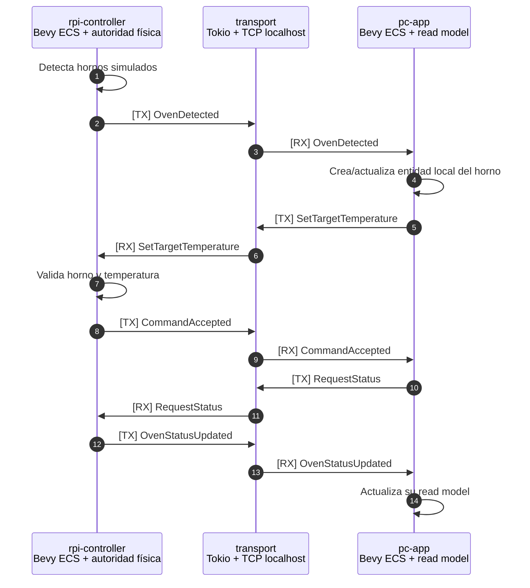
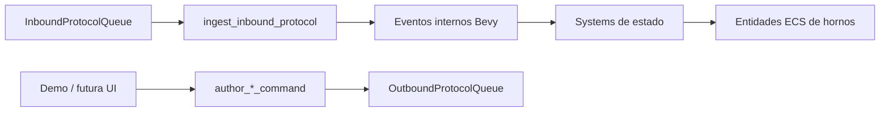
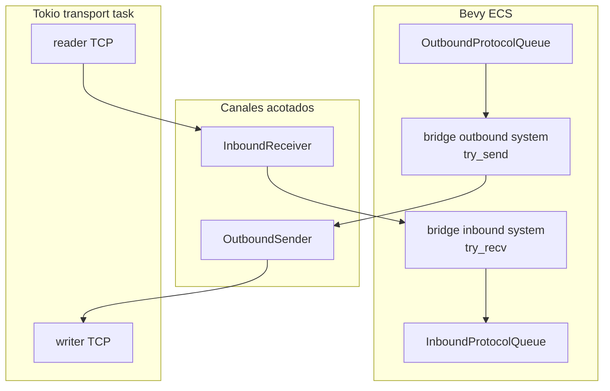

# Arquitectura explicada — PC, Raspberry, Bevy, Tokio y protocolo

Este documento explica el sistema en lenguaje simple: qué construimos, qué hace cada parte y por qué usamos Bevy ECS y Tokio juntos sin mezclar responsabilidades.

## Resumen en una frase

Construimos un sistema distribuido donde la **PC pide y muestra**, la **Raspberry decide y controla**, el **protocolo define el idioma común**, **Bevy ECS organiza el dominio** y **Tokio mueve mensajes TCP sin bloquear Bevy**.

```text
PC / pc-app ── TCP localhost ── rpi-controller / Raspberry
     │                                  │
     └────── protocol::EventEnvelope ───┘
```

## Qué problema resuelve esta arquitectura

Queremos controlar hornos desde una PC, pero sin que la PC sea la autoridad física.

La regla principal es:

> La PC declara intención. La Raspberry valida, ejecuta y reporta hechos.

Eso evita un error común: que la UI cambie estado como si fuera la realidad. En este sistema, el estado real lo reporta la Raspberry.

## Mapa de piezas

| Pieza | Qué es | Responsabilidad |
|---|---|---|
| `protocol` | Crate compartido | Define mensajes, payloads y `EventEnvelope`. |
| `pc-app` | App Bevy headless del PC | Mantiene una vista local de hornos y genera comandos. |
| `rpi-controller` | App Bevy headless de Raspberry | Mantiene estado real/simulado, valida comandos y publica eventos. |
| `transport` | Adaptador TCP | Conecta ambas apps por TCP localhost usando JSON lines. |
| Docs/ADRs | Trazabilidad | Explican decisiones y flujo del sistema. |

## Flujo completo de datos



## Cómo usamos Bevy en la PC

`pc-app` usa Bevy sin ventana todavía. No hay UI final. Es una app **headless**.

Su trabajo es mantener un modelo local de lo que la Raspberry informa.

### Responsabilidades de `pc-app`

| Responsabilidad | Cómo se representa |
|---|---|
| Saber qué hornos existen | Entidades ECS creadas desde `OvenDetected`. |
| Guardar estado visible | Componentes: temperatura actual, target, enabled, heating, status. |
| Guardar fallas | `FaultState` y `GlobalFault`. |
| Guardar resultado de comandos | `LastCommandResult`. |
| Enviar intenciones | Funciones que generan comandos en `OutboundProtocolQueue`. |

### Flujo interno del PC



La PC **no crea hornos físicos**. Si aparece un horno en PC, es porque la Raspberry emitió `OvenDetected`.

## Cómo usamos Bevy en la Raspberry

`rpi-controller` también usa Bevy headless. La diferencia es que acá vive la autoridad del estado físico.

Hoy la Raspberry está simulada, pero la arquitectura ya está preparada para reemplazar simulación por GPIO/sensores reales en el futuro.

### Responsabilidades de `rpi-controller`

| Responsabilidad | Cómo se representa |
|---|---|
| Crear hornos simulados | `spawn_simulated_ovens` en `Startup`. |
| Procesar comandos del PC | `InboundProtocolQueue` + systems de `Update`. |
| Validar reglas | Horno existe, temperatura válida, emergency stop, etc. |
| Simular temperatura | `FixedUpdate` con drift térmico. |
| Control térmico | Histéresis de 5°C. |
| Reportar hechos | `OutboundProtocolQueue` con `OvenDetected`, `CommandAccepted`, `OvenStatusUpdated`, etc. |

### Flujo interno de Raspberry


## Por qué Bevy ECS encaja en ambos lados

ECS separa datos y comportamiento.

| Concepto ECS | En este sistema |
|---|---|
| Entity | Un horno. |
| Component | Datos del horno: temperatura, estado, sensor, salida, falla. |
| Resource | Estado global: queues, índices, configuración, flags. |
| System | Función que procesa una responsabilidad concreta. |
| Schedule | Cuándo se ejecutan los systems: `Startup`, `Update`, `FixedUpdate`. |

La ventaja es que evitamos una clase gigante `Horno` con todo adentro. Cada dato vive en un componente y cada regla en un system específico.

## Cómo usamos Tokio

Tokio se usa **solo en el crate `transport`**.

Su responsabilidad es mover bytes por TCP:

- abrir socket
- aceptar/conectar
- leer líneas JSON
- escribir líneas JSON
- manejar tareas async

Tokio **no decide nada del dominio**. No sabe qué es un horno ni qué significa calentar.

## Por qué no hacemos TCP directamente dentro de Bevy

Un system de Bevy debe ser rápido y no bloqueante.

Si un system espera red directamente:

```rust
stream.read(...)
```

y no hay datos, puede congelar el schedule. Eso rompe Bevy.

Por eso usamos este puente:



Reglas clave:

- Bevy no espera red.
- Tokio no muta el `World` de Bevy.
- La comunicación cruza por canales acotados.
- Si la red se cae, el dominio no queda mezclado con sockets.

## Cómo se prueba hoy

Abrí dos terminales:

```bash
# Terminal 1: Raspberry simulada como servidor TCP
cargo run --package rpi-controller -- --simulate 2 --listen 127.0.0.1:7000

# Terminal 2: PC como cliente TCP con demo automática
cargo run --package pc-app -- --connect 127.0.0.1:7000 --demo
```

Deberías ver logs como:

```text
[TX] rpi-controller -> pc-app | OvenDetected | id=...
[RX] rpi-controller -> pc-app | OvenDetected | id=...
[TX] pc-app -> rpi-controller | SetTargetTemperature | id=...
[RX] pc-app -> rpi-controller | SetTargetTemperature | id=...
[TX] rpi-controller -> pc-app | CommandAccepted | id=...
[RX] rpi-controller -> pc-app | CommandAccepted | id=...
```

## Qué está verificado

| Paquete | Tests |
|---|---:|
| `protocol` | 93 |
| `transport` | 14 |
| `pc-app` | 23 |
| `rpi-controller` | 38 |
| **Total** | **168** |

## Qué NO es todavía

| Tema | Estado |
|---|---|
| UI visual | Pendiente. La PC todavía corre headless. |
| GPIO real | Pendiente. La Raspberry todavía simula hornos. |
| Serial físico | Pendiente. Hoy usamos TCP localhost. |
| Seguridad/red productiva | Pendiente. No hay auth, TLS ni multi-cliente. |

## Decisiones documentadas

| Decisión | Documento |
|---|---|
| Protocolo como enum Rust + serde | `docs/adr/001-protocolo-eventos-rust-enum.md` |
| Histéresis térmica de 5°C | `docs/adr/002-hysteresis-control-termico.md` |
| Tokio como adaptador de transporte para Bevy | `docs/adr/003-tokio-como-adaptador-transporte-bevy.md` |

## Cómo explicarlo en clase

La forma más simple:

1. **El protocolo es el idioma.** Define qué mensajes existen.
2. **La Raspberry es la autoridad.** Detecta hornos, valida comandos y reporta estado.
3. **La PC es el tablero.** Pide cambios y mantiene una copia visible del estado.
4. **Bevy organiza el dominio.** Hornos son entidades; datos son componentes; reglas son systems.
5. **Tokio transporta mensajes.** No decide nada; solo mueve JSON por TCP sin bloquear Bevy.

Si los estudiantes entienden eso, entienden la arquitectura.
