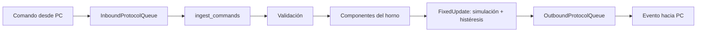
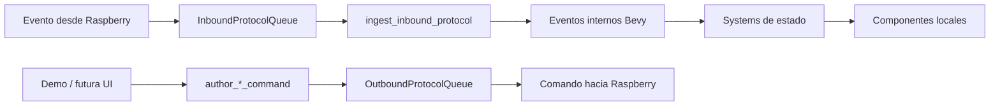
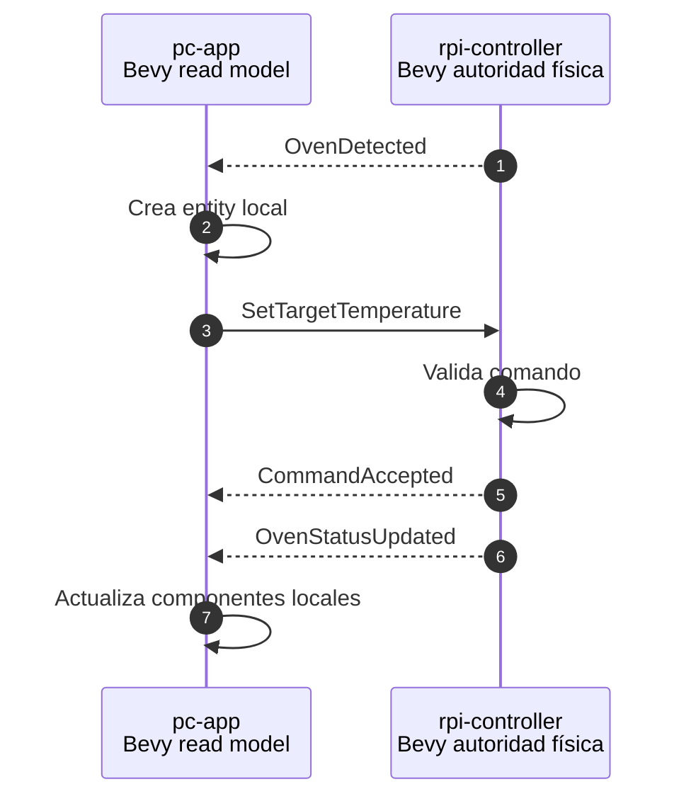

# Cómo usamos Bevy en PC y Raspberry

Este documento explica cómo aplicamos Bevy ECS en ambos lados del sistema. La idea central es simple: usamos Bevy para organizar estado y comportamiento, no porque estemos haciendo un juego.

## Resumen rápido

| Lado | Qué representa Bevy |
|---|---|
| `rpi-controller` | El estado real/controlador del sistema. |
| `pc-app` | Una copia local para operar y visualizar. |

La Raspberry es la autoridad. La PC mira, pide y espera confirmación.

> La PC declara intención. La Raspberry valida, ejecuta y reporta hechos.

## Las piezas de Bevy que usamos

| Pieza Bevy | Qué significa en este sistema |
|---|---|
| Entity | Un horno. |
| Component | Dato asociado al horno. |
| Resource | Estado global de la app. |
| System | Función que procesa una responsabilidad. |
| Schedule | Momento en que corren los systems. |

## Bevy en Raspberry: la realidad/control

`rpi-controller` representa el lado que decide sobre el mundo físico.

Hoy los hornos son simulados, pero la responsabilidad es la misma que tendrá con hardware real:

- detectar hornos
- mantener estado real
- validar comandos
- simular/controlar temperatura
- reportar estado y fallas

### Un horno en Raspberry

Un horno es una `Entity` con componentes:

```text
Entity
├── OvenId("oven-1")
├── SensorRef("temp0")
├── OutputRef("relay0")
├── CurrentTemperature(180.0)
├── TargetTemperature(250.0)
├── MaxTemperature(300.0)
├── Enabled(true)
├── Heating(true)
└── OvenStatus(Heating)
```

La entity es solo identidad. Los componentes son los datos.

### Systems importantes en Raspberry

| System | Responsabilidad |
|---|---|
| `spawn_simulated_ovens` | Crea hornos simulados al iniciar. |
| `ingest_commands` | Lee comandos que llegan desde PC. |
| `emit_protocol_responses` | Envía respuestas por protocolo. |
| `simulate_thermal_drift` | Simula subida/bajada de temperatura. |
| `check_hysteresis` | Decide si el horno calienta usando histéresis. |
| `check_faults` | Detecta condiciones anormales. |
| `publish_status` | Publica `OvenStatusUpdated`. |

### Flujo interno en Raspberry



## Bevy en PC: copia local/read model

`pc-app` no controla la realidad. Mantiene una copia local del estado que informa la Raspberry.

Esa copia sirve para:

- mostrar hornos
- mostrar temperatura actual y deseada
- mostrar estado operativo
- mostrar fallas
- enviar comandos

### Un horno en PC

Cuando llega `OvenDetected`, la PC crea o actualiza una entity local:

```text
Entity
├── OvenId("oven-1")
├── SensorRef("temp0")
├── OutputRef("relay0")
├── CurrentTemperature(180.0)
├── TargetTemperature(250.0)
├── MaxTemperature(300.0)
├── Enabled(true)
├── Heating(true)
├── OvenStatus(Heating)
├── FaultState(None)
└── LastCommandResult(Some(...))
```

Es importante: esta entity no es el horno real. Es la representación local del horno reportado por Raspberry.

### Systems importantes en PC

| System / función | Responsabilidad |
|---|---|
| `ingest_inbound_protocol` | Lee eventos que llegan desde Raspberry. |
| `apply_oven_detected` | Crea/actualiza entidad local del horno. |
| `apply_oven_status_updated` | Actualiza temperatura, target, estado y flags. |
| `apply_fault_raised` | Registra fallas de horno o globales. |
| `record_command_result` | Guarda si un comando fue aceptado o rechazado. |
| `author_set_target_temperature_command` | Genera comando para cambiar temperatura. |
| `author_set_oven_enabled_command` | Genera comando para habilitar/deshabilitar. |
| `author_request_status_command` | Genera comando para pedir estado. |
| `author_emergency_stop_command` | Genera comando de parada de emergencia. |

### Flujo interno en PC



## Diferencia clave entre ambos lados

| Pregunta | Raspberry | PC |
|---|---|---|
| ¿Quién crea hornos? | Raspberry. | Solo refleja lo que Raspberry reporta. |
| ¿Quién valida comandos? | Raspberry. | No valida reglas físicas. |
| ¿Quién controla salidas? | Raspberry. | Nunca. |
| ¿Quién muestra estado? | Puede loguear. | Es su responsabilidad futura con UI. |
| ¿Qué representa ECS? | Estado real/controlador. | Read model local. |

## Flujo completo entre ambos



## Por qué usamos el mismo patrón ECS en ambos lados

Porque ambos lados tienen estado que cambia por eventos.

Pero cada lado tiene una responsabilidad distinta:

```text
Raspberry = fuente de verdad
PC        = copia para operar y visualizar
```

Usar Bevy en ambos lados nos da un lenguaje común:

- entities para hornos
- components para datos
- resources para colas/estado global
- systems para comportamiento
- schedules para orden y periodicidad

## Qué NO debe pasar

La PC no debe hacer esto:

```text
"Cambio mi componente local y asumo que el horno real cambió"
```

La forma correcta es:

```text
PC envía comando
Raspberry valida
Raspberry responde
PC actualiza su copia local
```

Ese ida y vuelta es lo que hace confiable al sistema.

## Analogía simple

| Parte | Analogía |
|---|---|
| Raspberry | Sala de máquinas. Tiene sensores, actuadores y reglas de seguridad. |
| PC | Tablero de control. Muestra estado y manda pedidos. |
| Protocolo | Idioma común entre tablero y sala de máquinas. |
| Bevy ECS | Forma ordenada de organizar el estado y las reglas. |
| Tokio/transport | Cable de comunicación entre ambas partes. |

## Idea final para estudiantes

Si entendés esto, entendés el sistema:

1. Un horno es una entity.
2. Sus datos son components.
3. Las reglas son systems.
4. La Raspberry tiene la verdad.
5. La PC tiene una copia para operar.
6. El protocolo transporta intenciones y hechos.
7. Tokio solo mueve mensajes; no decide nada del dominio.
