# Diagrama de Clases — Sistema de Control de Hornos (ECS)

## Diagrama UML (Mermaid)

```mermaid
classDiagram

    %% ============================================================
    %% ENTIDADES (estereotipo <<Entity>>)
    %% ============================================================

    class Entity {
        <<Bevy - interno>>
        +id: u64
        +generation: u32
        NOTA: "Una entidad es SOLO un ID. No tiene datos ni comportamiento."
    }

    %% ============================================================
    %% COMPONENTS (estereotipo <<Component>>)
    %% ============================================================

    class Horno {
        <<Component>>
        +id: u8
        +temp_actual: f32
        +temp_deseada: f32
        +pwm_actual: u8
        +habilitado: bool
    }

    class PIDState {
        <<Component>>
        +kp: f32
        +ki: f32
        +kd: f32
        +integral: f32
        +error_previo: f32
    }

    class HistorialTemperatura {
        <<Component>>
        +muestras: VecDeque~f32~
        +max_muestras: usize
    }

    class Alarma {
        <<Component>>
        +temp_maxima: f32
        +activa: bool
    }

    %% ============================================================
    %% RESOURCES (estereotipo <<Resource>>)
    %% ============================================================

    class SerialConnection {
        <<Resource>>
        +port: SerialPort
        +conectado: bool
    }

    class BufferSerial {
        <<Resource>>
        +tx: VecDeque~MensajeSaliente~
        +rx: VecDeque~MensajeEntrante~
    }

    class ConfiguracionSistema {
        <<Resource>>
        +intervalo_lectura_ms: u64
        +max_hornos: u8
        +baud_rate: u32
    }

    %% ============================================================
    %% EVENTS (estereotipo <<Event>>)
    %% ============================================================

    class LecturaTemperatura {
        <<Event>>
        +horno_id: u8
        +valor: f32
    }

    class ComandoPWM {
        <<Event>>
        +horno_id: u8
        +valor: u8
    }

    class HornoAgregado {
        <<Event>>
        +id: u8
        +temp_deseada: f32
    }

    class HornoRemovido {
        <<Event>>
        +id: u8
    }

    %% ============================================================
    %% SYSTEMS (estereotipo <<System>>)
    %% ============================================================

    class SerialReader {
        <<System>>
        +lee bytes del puerto serial
        +parsea JSON
        +push a BufferSerial.rx
        --
        Usa: SerialConnection, BufferSerial
    }

    class SensorUpdater {
        <<System>>
        +procesa mensajes entrantes
        +actualiza temp_actual en Horno
        +emite LecturaTemperatura
        --
        Usa: BufferSerial, Query~Horno~
        Emite: LecturaTemperatura
    }

    class PIDController {
        <<System>>
        +calcula error (deseada - actual)
        +actualiza integral (anti-windup)
        +calcula derivativo
        +aplica formula PID
        +clamp resultado a 0-255
        +actualiza pwm_actual en Horno
        +emite ComandoPWM
        --
        Usa: Query~(Horno, PIDState)~, Time
        Emite: ComandoPWM
    }

    class HistoryRecorder {
        <<System>>
        +escucha LecturaTemperatura
        +agrega muestra al historial
        +elimina muestras viejas (FIFO)
        --
        Escucha: LecturaTemperatura
        Usa: Query~HistorialTemperatura~
    }

    class PWMSender {
        <<System>>
        +escucha ComandoPWM
        +serializa JSON
        +push a BufferSerial.tx
        --
        Escucha: ComandoPWM
        Usa: BufferSerial
    }

    class SerialWriter {
        <<System>>
        +toma mensajes de BufferSerial.tx
        +escribe al puerto serial
        --
        Usa: SerialConnection, BufferSerial
    }

    class HornoSpawner {
        <<System>>
        +escucha HornoAgregado
        +crea nueva Entity
        +attacha Components: Horno, PIDState, HistorialTemperatura
        --
        Escucha: HornoAgregado
    }

    class HornoDespawner {
        <<System>>
        +escucha HornoRemovido
        +elimina Entity y sus Components
        --
        Escucha: HornoRemovido
    }

    class AlarmaSystem {
        <<System>>
        +escucha LecturaTemperatura
        +verifica si temp > temp_maxima
        +activa/desactiva alarma
        --
        Escucha: LecturaTemperatura
        Usa: Query~(Horno, Alarma)~
    }

    %% ============================================================
    %% PROTOCOLO (mensajes serial)
    %% ============================================================

    class MensajeEntrante {
        <<Protocolo>>
        +horno_id: u8
        +tipo: TipoMensaje
        +valor: f32
    }

    class MensajeSaliente {
        <<Protocolo>>
        +horno_id: u8
        +tipo: TipoMensaje
        +valor: f32
    }

    %% ============================================================
    %% RELACIONES: Entity composicion con Components
    %% ============================================================

    Entity "1" --o "0..*" Horno : "puede tener"
    Entity "1" --o "0..*" PIDState : "puede tener"
    Entity "1" --o "0..*" HistorialTemperatura : "puede tener"
    Entity "1" --o "0..1" Alarma : "puede tener"

    %% RELACIONES: Systems acceden a Components via Query
    SensorUpdater ..> Horno : "Query<mut Horno>"
    PIDController ..> Horno : "Query<(mut Horno, mut PIDState)>"
    PIDController ..> PIDState : "Query<(mut Horno, mut PIDState)>"
    HistoryRecorder ..> HistorialTemperatura : "Query<mut HistorialTemperatura>"
    AlarmaSystem ..> Horno : "Query<(Horno, mut Alarma)>"
    AlarmaSystem ..> Alarma : "Query<(Horno, mut Alarma)>"

    %% RELACIONES: Systems usan Resources
    SerialReader ..> SerialConnection : "ResMut"
    SerialReader ..> BufferSerial : "ResMut"
    SensorUpdater ..> BufferSerial : "ResMut"
    PWMSender ..> BufferSerial : "ResMut"
    SerialWriter ..> SerialConnection : "ResMut"
    SerialWriter ..> BufferSerial : "ResMut"

    %% RELACIONES: Events emitidos y consumidos
    SensorReader ..> LecturaTemperatura : "EventWriter"
    HistoryRecorder ..> LecturaTemperatura : "EventReader"
    AlarmaSystem ..> LecturaTemperatura : "EventReader"
    PIDController ..> ComandoPWM : "EventWriter"
    PWMSender ..> ComandoPWM : "EventReader"
    HornoSpawner ..> HornoAgregado : "EventReader"
    HornoDespawner ..> HornoRemovido : "EventReader"

    %% RELACIONES: Buffer contiene mensajes del protocolo
    BufferSerial "1" *-- "0..*" MensajeEntrante : "rx queue"
    BufferSerial "1" *-- "0..*" MensajeSaliente : "tx queue"

    %% RELACIONES: Protocolo sobre Serial
    SerialConnection ..> MensajeSaliente : "envía por serial"
    SerialConnection ..> MensajeEntrante : "recibe por serial"
```

## Notación usada

| Estereotipo | Significado | Equivalente OOP |
|---|---|---|
| `<<Entity>>` | Solo un ID, sin datos ni comportamiento | Referencia/identificador de objeto |
| `<<Component>>` | Datos puros que se asocian a una Entity | Atributos de un objeto (sin métodos) |
| `<<System>>` | Función que opera sobre Components | Service / Use Case / método de negocio |
| `<<Resource>>` | Singleton global de la aplicación | Singleton / Service Locator |
| `<<Event>>` | Mensaje broadcast entre Systems | Patrón Observer / EventBus |
| `<<Protocolo>>` | Tipos compartidos para comunicación serial | DTO (Data Transfer Object) |

## Relaciones

| Notación | Significado |
|---|---|
| `--o` (agregación) | Una Entity puede tener 0 o N Components (composición flexible) |
| `*--` (composición) | BufferSerial contiene Mensajes (vida compartida) |
| `..>` (dependencia) | Un System depende de un Component/Resource/Event |
