# Diagrama de Componentes — Sistema de Control de Hornos (ECS Real)

> **Actualizado**: 2026-05-28
> Refleja la arquitectura implementada después de los cambios `protocol`, `rpi-controller-bevy-headless`, `pc-app` y `pc-rpi-transport-link`.

## Diagrama UML (Mermaid)

```mermaid
classDiagram

    %% ============================================================
    %% PROTOCOLO (crate compartido)
    %% ============================================================

    class EventEnvelope {
        <<Protocol>>
        +event_id: Uuid
        +source: String
        +target: String
        +timestamp: DateTime~Utc~
        +correlation_id: Option~Uuid~
        +version: String
        +payload: Message
        +new(source, target, payload) EventEnvelope
    }

    class Message {
        <<Protocol>>
        <<serde(tag, content)>>
        SetTargetTemperature
        SetOvenEnabled
        RequestStatus
        EmergencyStop
        OvenDetected
        CommandAccepted
        CommandRejected
        OvenStatusUpdated
        FaultRaised
    }

    Message --> SetTargetTemperaturePayload
    Message --> SetOvenEnabledPayload
    Message --> RequestStatusPayload
    Message --> EmergencyStopPayload
    Message --> OvenDetectedPayload
    Message --> CommandAcceptedPayload
    Message --> CommandRejectedPayload
    Message --> OvenStatusUpdatedPayload
    Message --> FaultRaisedPayload

    class OvenState {
        <<Protocol>>
        disabled | idle | heating
        faulted | emergency_stopped
    }

    class FaultCode {
        <<Protocol>>
        OvenNotFound | SensorUnavailable
        InvalidTemperature | OutputUnavailable
        SafetyLimitExceeded | EmergencyStopActive
    }

    class Severity {
        <<Protocol>>
        Low | Medium | High | Critical
    }

    EventEnvelope --> Message : payload

    %% ============================================================
    %% RPI-CONTROLLER (Bevy ECS headless)
    %% ============================================================

    class RPI_Entity {
        <<rpi-controller: Entity>>
        NOTA: "Created by spawn_simulated_ovens (Startup)"
    }

    class RPI_OvenId {
        <<Component>>
        +oven_id: String
    }

    class RPI_SensorRef {
        <<Component>>
        +sensor_ref: String
    }

    class RPI_OutputRef {
        <<Component>>
        +output_ref: String
    }

    class RPI_CurrentTemperature {
        <<Component>>
        +celsius: f64
    }

    class RPI_TargetTemperature {
        <<Component>>
        +celsius: f64
    }

    class RPI_MaxTemperature {
        <<Component>>
        +celsius: f64
    }

    class RPI_Enabled {
        <<Component>>
        +enabled: bool
    }

    class RPI_Heating {
        <<Component>>
        +heating: bool
    }

    class RPI_OvenStatus {
        <<Component>>
        +state: OvenState
    }

    RPI_Entity "1" --> RPI_OvenId
    RPI_Entity "1" --> RPI_SensorRef
    RPI_Entity "1" --> RPI_OutputRef
    RPI_Entity "1" --> RPI_CurrentTemperature
    RPI_Entity "1" --> RPI_TargetTemperature
    RPI_Entity "1" --> RPI_MaxTemperature
    RPI_Entity "1" --> RPI_Enabled
    RPI_Entity "1" --> RPI_Heating
    RPI_Entity "1" --> RPI_OvenStatus

    class RPI_Resources {
        <<rpi-controller: Resource>>
        InboundProtocolQueue
        OutboundProtocolQueue
        OvenIndex
        SimulationConfig
        ControllerConfig
        TestRng
        EmergencyStopActive
        SimulateOvenCount
        LastStatusPublishTime
    }

    class RPI_Systems {
        <<rpi-controller: Schedule>>
        Startup: spawn_simulated_ovens
        Update: ingest_commands, emit_protocol_responses
        FixedUpdate: simulate_thermal_drift, check_hysteresis, check_faults, publish_status
    }

    %% ============================================================
    %% PC-APP (Bevy ECS headless)
    %% ============================================================

    class PC_Entity {
        <<pc-app: Entity>>
        NOTA: "Created by apply_oven_detected (Update)"
    }

    class PC_OvenId {
        <<Component>>
        +oven_id: String
    }

    class PC_SensorRef {
        <<Component>>
        +sensor_ref: String
    }

    class PC_OutputRef {
        <<Component>>
        +output_ref: String
    }

    class PC_CurrentTemperature {
        <<Component>>
        +celsius: f64
    }

    class PC_TargetTemperature {
        <<Component>>
        +celsius: f64
    }

    class PC_MaxTemperature {
        <<Component>>
        +celsius: f64
    }

    class PC_Enabled {
        <<Component>>
        +enabled: bool
    }

    class PC_Heating {
        <<Component>>
        +heating: bool
    }

    class PC_OvenStatus {
        <<Component>>
        +state: OvenState
    }

    class PC_FaultState {
        <<Component>>
        +fault: Option~FaultInfo~
    }

    class PC_LastCommandResult {
        <<Component>>
        +result: Option~CommandResult~
    }

    PC_Entity "1" --> PC_OvenId
    PC_Entity "1" --> PC_SensorRef
    PC_Entity "1" --> PC_OutputRef
    PC_Entity "1" --> PC_CurrentTemperature
    PC_Entity "1" --> PC_TargetTemperature
    PC_Entity "1" --> PC_MaxTemperature
    PC_Entity "1" --> PC_Enabled
    PC_Entity "1" --> PC_Heating
    PC_Entity "1" --> PC_OvenStatus
    PC_Entity "1" --> PC_FaultState
    PC_Entity "1" --> PC_LastCommandResult

    class PC_Resources {
        <<pc-app: Resource>>
        InboundProtocolQueue
        OutboundProtocolQueue
        OvenIndex
        GlobalFault
    }

    class PC_Systems {
        <<pc-app: Schedule>>
        Update: ingest_inbound_protocol
        FixedUpdate: apply_oven_detected, apply_oven_status_updated, apply_fault_raised, record_command_result
    }

    class PC_CommandFunctions {
        <<pc-app: standalone>>
        author_set_target_temperature_command
        author_set_oven_enabled_command
        author_request_status_command
        author_emergency_stop_command
    }

    PC_CommandFunctions ..> PC_Resources : "push to OutboundProtocolQueue"

    %% ============================================================
    %% TRANSPORT (adaptador TCP localhost)
    %% ============================================================

    class TransportConfig {
        <<transport: Config>>
        +address: SocketAddr
        +is_server: bool
        +channel_capacity: usize = 64
        +local_label: String
        +remote_label: String
        +server(address) TransportConfig
        +client(address) TransportConfig
    }

    class TransportPlugin {
        <<transport: Bevy Plugin>>
        +config: TransportConfig
        +build(app)
    }

    class OutboundSender {
        <<transport: Resource>>
        +sender_mpsc_batch_channel
    }

    class InboundReceiver {
        <<transport: Resource>>
        +receiver_mutex_mpsc_batch_channel
    }

    class TokioRuntime {
        <<transport: Resource>>
        tokio::runtime::Runtime
    }

    class TransportModules {
        <<transport: modules>>
        framing: JSON lines
        server: TCP listener
        client: TCP connector
        task: reader/writer tasks
        logging: TX/RX logs
        systems: Bevy bridge
    }

    class TransportSystems {
        <<transport: Bevy systems>>
        bridge_outbound_to_transport
        bridge_inbound_from_transport
        uses_try_send_try_recv_only
    }

    TransportPlugin --> TransportConfig : uses
    TransportPlugin --> TokioRuntime : inserts
    TransportPlugin --> OutboundSender : inserts
    TransportPlugin --> InboundReceiver : inserts
    TransportPlugin --> TransportModules : spawns/uses
    TransportSystems --> OutboundSender : sends outbound batches
    TransportSystems --> InboundReceiver : receives inbound batches
    TransportModules ..> EventEnvelope : JSON line framing

    %% ============================================================
    %% FLUJO DE DATOS
    %% ============================================================

    note for PC_Resources "InboundProtocolQueue ← bridge_inbound_from_transport\nOutboundProtocolQueue → bridge_outbound_to_transport"

    note for RPI_Resources "InboundProtocolQueue ← bridge_inbound_from_transport\nOutboundProtocolQueue → bridge_outbound_to_transport"

    PC_Resources ..> TransportSystems : bounded channel bridge capacity 64
    RPI_Resources ..> TransportSystems : bounded channel bridge capacity 64

```

## Resumen de componentes reales (Mayo 2026)

### Protocol — Crate compartido

| Tipo            | Elementos                           | Tests              |
| --------------- | ----------------------------------- | ------------------ |
| `EventEnvelope` | Envelope con metadatos + `Message`  | Serde roundtrip    |
| `Message`       | 9 variantes (4 commands + 5 events) | Discriminante JSON |
| Payloads        | 9 structs tipados                   | Serde roundtrip    |

### rpi-controller — Bevy ECS headless (9 componentes / 7 resources / 3 schedules)

| Schedule             | Systems                                                                        |
| -------------------- | ------------------------------------------------------------------------------ |
| `Startup`            | `spawn_simulated_ovens`                                                        |
| `Update`             | `ingest_commands`, `emit_protocol_responses`                                   |
| `FixedUpdate` (50ms) | `simulate_thermal_drift`, `check_hysteresis`, `check_faults`, `publish_status` |

| Resource                | Propósito                                 |
| ----------------------- | ----------------------------------------- |
| `InboundProtocolQueue`  | Cola de mensajes entrantes desde PC       |
| `OutboundProtocolQueue` | Cola de mensajes salientes hacia PC       |
| `OvenIndex`             | Mapa `oven_id → Entity`                   |
| `SimulationConfig`      | Constantes de drift térmico e histéresis  |
| `ControllerConfig`      | Intervalos de tick y publicación          |
| `TestRng`               | RNG determinista para tests               |
| `EmergencyStopActive`   | Flag de parada de emergencia              |
| `SimulateOvenCount`     | Cantidad de hornos simulados al inicio    |
| `LastStatusPublishTime` | Timestamp de última publicación de estado |

### pc-app — Bevy ECS headless (11 componentes / 4 resources / 4 funciones de comando)

| Schedule             | Systems                                                                                           |
| -------------------- | ------------------------------------------------------------------------------------------------- |
| `Update`             | `ingest_inbound_protocol`                                                                         |
| `FixedUpdate` (50ms) | `apply_oven_detected`, `apply_oven_status_updated`, `apply_fault_raised`, `record_command_result` |

| Resource                | Propósito                            |
| ----------------------- | ------------------------------------ |
| `InboundProtocolQueue`  | Cola de mensajes entrantes desde RPi |
| `OutboundProtocolQueue` | Cola de mensajes salientes hacia RPi |
| `OvenIndex`             | Mapa `oven_id → Entity`              |
| `GlobalFault`           | Falla técnica global (sin oven\_id)  |

| Función standalone                      | Comando que genera     |
| --------------------------------------- | ---------------------- |
| `author_set_target_temperature_command` | `SetTargetTemperature` |
| `author_set_oven_enabled_command`       | `SetOvenEnabled`       |
| `author_request_status_command`         | `RequestStatus`        |
| `author_emergency_stop_command`         | `EmergencyStop`        |

### transport — Adaptador TCP localhost verificado

| Elemento          | Propósito                                                               |
| ----------------- | ----------------------------------------------------------------------- |
| `TransportConfig` | Define dirección, modo server/client, capacidad 64 y etiquetas de logs. |
| `TransportPlugin` | Crea el runtime Tokio, canales acotados y tareas TCP.                   |
| `OutboundSender`  | Resource Bevy para enviar lotes desde ECS hacia la tarea Tokio.         |
| `InboundReceiver` | Resource Bevy para recibir lotes desde la tarea Tokio hacia ECS.        |
| `TokioRuntime`    | Mantiene vivo el runtime async mientras vive la app Bevy.               |
| `framing`         | Serializa/deserializa un `EventEnvelope` por línea JSON.                |
| `server`          | RPi: escucha `127.0.0.1:7000` y acepta una conexión.                    |
| `client`          | PC: conecta al servidor RPi.                                            |
| `task`            | Ejecuta lector y escritor TCP en Tokio.                                 |
| `logging`         | Emite logs observables con prefijos `[TX]` y `[RX]`.                    |
| `systems`         | Puente no bloqueante entre queues Bevy y canales Tokio.                 |

| Dirección | Estado       | Medio                                                                               |
| --------- | ------------ | ----------------------------------------------------------------------------------- |
| PC → RPi  | ✅ Verificado | `OutboundProtocolQueue` → canal acotado 64 → TCP JSON line → `InboundProtocolQueue` |
| RPi → PC  | ✅ Verificado | `OutboundProtocolQueue` → canal acotado 64 → TCP JSON line → `InboundProtocolQueue` |

Regla importante: Tokio no muta el `World` de Bevy. Las tareas async sólo leen/escriben sockets y se comunican con ECS mediante canales acotados.

## Archivos de la implementación real

| Crate             | Archivos clave                                                                                                                    |
| ----------------- | --------------------------------------------------------------------------------------------------------------------------------- |
| `protocol/`       | `src/message.rs`, `src/payloads.rs`, `src/types.rs`, `src/event_envelope.rs`                                                      |
| `transport/`      | `src/lib.rs`, `src/framing.rs`, `src/server.rs`, `src/client.rs`, `src/task.rs`, `src/systems.rs`, `src/logging.rs`               |
| `rpi-controller/` | `src/components.rs`, `src/resources.rs`, `src/events.rs`, `src/systems/*.rs`, `src/plugins/oven_controller.rs`, `src/bevy_app.rs` |
| `pc-app/`         | `src/components.rs`, `src/resources.rs`, `src/events.rs`, `src/systems/*.rs`, `src/plugins/pc_app.rs`                             |

