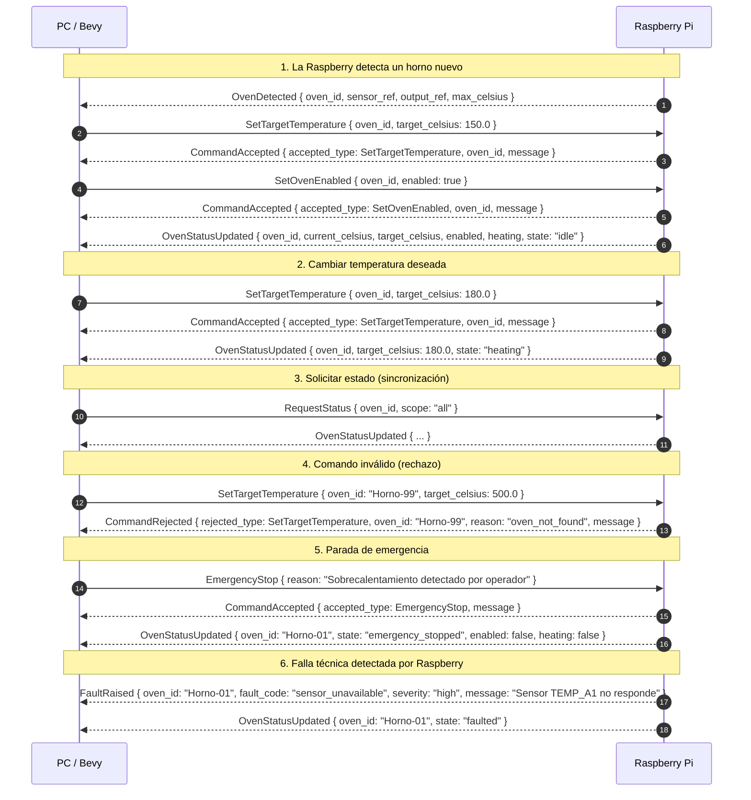

# Flujo de Protocolo — PC ↔ Raspberry Pi

Este documento muestra cómo se ve el protocolo en acción. PC y Raspberry Pi se tratan como **cajas negras**: no importa qué hay adentro, solo qué mensajes se envían y qué se espera recibir.

> **Regla base**: El PC declara intención. La Raspberry valida, ejecuta y reporta hechos.

---

## Diagrama General de Secuencia



---

## Flujo 1: La Raspberry detecta un horno nuevo

| Paso | Quién envía | Mensaje | Qué significa |
|---|---|---|---|
| 1 | Raspberry | `OvenDetected` | "Detecté un sensor y un actuador nuevos: esto es un horno." |
| 2 | PC | `SetTargetTemperature` | "Configurá la temperatura deseada a 150°C." |
| 3 | Raspberry | `CommandAccepted` | "Temperatura configurada." |
| 4 | PC | `SetOvenEnabled` | "Habilitá el horno para que opere." |
| 5 | Raspberry | `CommandAccepted` | "Horno habilitado." |
| 6 | Raspberry | `OvenStatusUpdated` | "Este es el estado actual del horno." |

**Notas**:
- La Raspberry es la autoridad física: detecta hardware nuevo y avisa a la PC.
- La PC solo muestra lo que existe. Nunca crea hornos.
- La configuración operativa (temperatura, habilitación) se hace con comandos normales después del descubrimiento.

---

## Flujo 2: Cambiar temperatura deseada

| Paso | Quién envía | Mensaje | Qué significa |
|---|---|---|---|
| 1 | PC | `SetTargetTemperature` | "Quiero que este horno vaya a 180°C." |
| 2 | Raspberry | `CommandAccepted` | "La temperatura es válida y el horno existe." |
| 3 | Raspberry | `OvenStatusUpdated` | "El horno ahora está calentando hacia 180°C." |

**Notas**:
- La Raspberry valida que el horno exista y que la temperatura no exceda `max_celsius`.
- La Raspberry decide cuándo cambiar el estado a `heating` según su lógica de control.
- El PC no sabe si el horno está calentando hasta que recibe `OvenStatusUpdated`.

---

## Flujo 3: Solicitar estado (sincronización)

| Paso | Quién envía | Mensaje | Qué significa |
|---|---|---|---|
| 1 | PC | `RequestStatus` | "Dame el estado actual de todos los hornos." |
| 2 | Raspberry | `OvenStatusUpdated` (xN) | "Estado del horno 1... del horno 2... etc." |

**Notas**:
-Útil cuando la PC se reconecta o arranca y necesita sincronizarse.
- La Raspberry responde con un `OvenStatusUpdated` por cada horno registrado.
- No hay `CommandAccepted` para `RequestStatus`: la respuesta directa es el estado.

---

## Flujo 4: Comando inválido (rechazo)

| Paso | Quién envía | Mensaje | Qué significa |
|---|---|---|---|
| 1 | PC | `SetTargetTemperature` (a horno inexistente) | "Quiero cambiar temperatura de Horno-99." |
| 2 | Raspberry | `CommandRejected` | "Ese horno no existe. Comando rechazado." |

**Notas**:
- El PC debe usar el `correlation_id` del mensaje original para saber qué comando fue rechazado.
- La razón del rechazo usa un `FaultCode` estándar (`oven_not_found`, `invalid_temperature`, etc.).
- El PC nunca debe asumir que un comando fue aplicado hasta recibir `CommandAccepted`.

---

## Flujo 5: Parada de emergencia

| Paso | Quién envía | Mensaje | Qué significa |
|---|---|---|---|
| 1 | PC | `EmergencyStop` | "Detené todo AHORA." |
| 2 | Raspberry | `CommandAccepted` | "Parada de emergencia activada." |
| 3 | Raspberry | `OvenStatusUpdated` (por cada horno) | "Todos los hornos están en estado seguro." |

**Notas**:
- La Raspberry desactiva salidas físicas inmediatamente, independientemente de la conexión con la PC.
- El sistema queda en estado `emergency_stopped` hasta que se resetee manualmente (futuro).
- Es el único comando que la Raspberry ejecuta incluso si hay fallas activas.

---

## Flujo 6: Falla técnica detectada por Raspberry

| Paso | Quién envía | Mensaje | Qué significa |
|---|---|---|---|
| 1 | Raspberry | `FaultRaised` | "Detecté una falla: el sensor no responde." |
| 2 | Raspberry | `OvenStatusUpdated` | "El horno afectado está en estado faulted." |

**Notas**:
- La falla puede o no estar asociada a un horno específico (`oven_id` puede ser `None` si es falla del sistema).
- El PC no pidió nada. La falla es un evento asíncrono generado por la Raspberry.
- Después de `FaultRaised`, la Raspberry puede seguir operando otros hornos o entrar en estado seguro según la severidad.

---

## Reglas del protocolo en resumen

| Regla | Explicación |
|---|---|
| **El PC solo pide** | Nunca actualiza estado directamente. Espera confirmación. |
| **La Raspberry decide** | Valida, ejecuta y reporta. Es la autoridad del estado físico. |
| **Cada comando tiene respuesta** | `CommandAccepted` o `CommandRejected`. Nunca silencio. |
| **El estado cambia, se reporta** | Cada cambio relevante genera `OvenStatusUpdated`. |
| **Las fallas son eventos** | `FaultRaised` informa condiciones anormales sin depender de comandos previos. |
| **Envelope obligatorio** | Todo mensaje lleva `event_id`, `timestamp`, `version`, `source`, `target`. |
| **Correlación** | Respuestas usan `correlation_id` del comando que las originó. |

---

---

## Estado actual: arquitectura implementada (Mayo 2026)

Este documento describe el **protocolo ideal** entre PC y Raspberry. El **estado real de implementación** es parcial:

| Capa | Estado | Detalle |
|---|---|---|
| Protocolo (`Message` enum + `EventEnvelope`) | ✅ Completado | Tipado, serde, 85 tests |
| `rpi-controller` (Bevy ECS headless) | ✅ Completado | Procesa comandos, simula temperatura, emite eventos |
| `pc-app` (Bevy ECS headless) | ✅ Completado | Read model, authoring de comandos, 23 tests |
| **Transporte PC ↔ Raspberry** | ❌ Pendiente | No hay serial ni TCP conectando ambos procesos |

### Consecuencia

Hoy los dos procesos existen, pero no se comunican. Cada uno tiene sus colas internas:

```
pc-app ─── OutboundProtocolQueue ──?── InboundProtocolQueue ─── rpi-controller
rpi-controller ─── OutboundProtocolQueue ──?── InboundProtocolQueue ─── pc-app
```

El transporte (`?`) es el próximo cambio planificado.

### Cómo probar cada lado hoy

**rpi-controller** (simula hornos y responde comandos):
```bash
cargo run --package rpi-controller -- --simulate 3
```

**pc-app** (procesa eventos y autoriza comandos en vacío):
```bash
cargo run --package pc-app
```

Para probar el flujo completo sin transporte, se usan los tests de integración de cada crate:
```bash
cargo test --workspace   # 154 tests total
```

## Referencias

- `docs/prd-sistema-control-hornos.md`
- `docs/events.md`
- `docs/adr/001-protocolo-eventos-rust-enum.md`
- `docs/adr/002-hysteresis-control-termico.md`
- `docs/estado-actual.md`
- `openspec/changes/protocol/specs/protocol-message-serialization/spec.md`
- `openspec/changes/pc-app/verify-report.md`
- `openspec/changes/archive/2026-05-21-rpi-controller-bevy-headless/archive-report.md`
