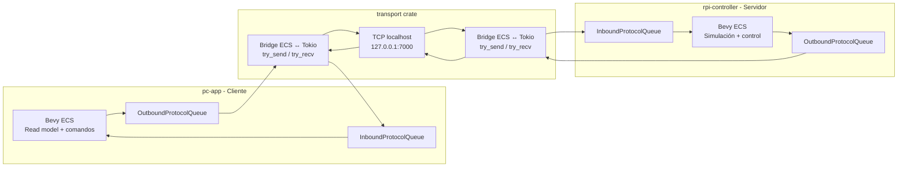
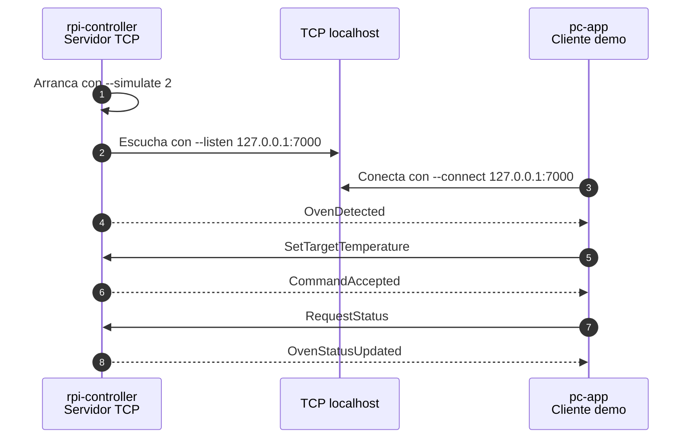
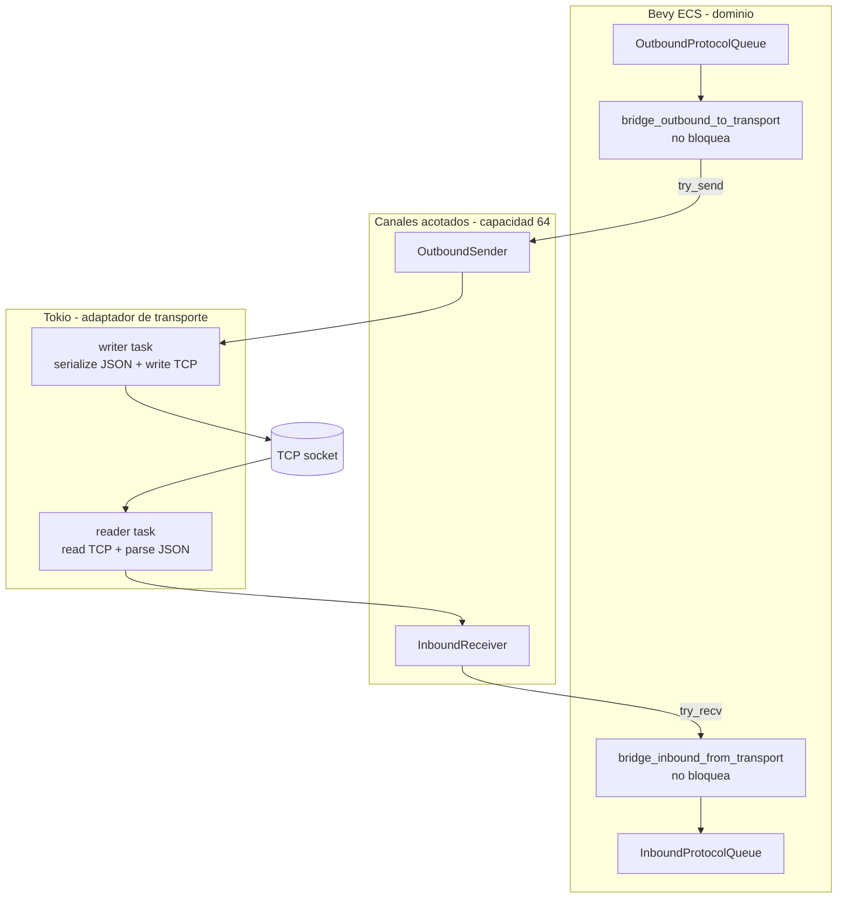

# Flujo de Datos del Transporte PC ↔ Raspberry

El transporte ya conecta dos procesos locales: `rpi-controller` escucha como servidor TCP y `pc-app` se conecta como cliente. La comunicación usa `EventEnvelope` serializado como una línea JSON por mensaje.

La idea clave para estudiantes: **Bevy ECS sigue manejando el dominio; Tokio sólo mueve bytes por TCP**.

## Camino rápido

Abrí dos terminales.

```bash
# Terminal 1: Raspberry simulada como servidor
cargo run --package rpi-controller -- --simulate 2 --listen 127.0.0.1:7000

# Terminal 2: PC como cliente con demo automática
cargo run --package pc-app -- --connect 127.0.0.1:7000 --demo
```

Qué deberías observar:

- La Raspberry escucha en `127.0.0.1:7000`.
- La PC se conecta a esa dirección.
- Aparecen logs con `[TX]` cuando un proceso envía un mensaje.
- Aparecen logs con `[RX]` cuando un proceso recibe un mensaje.
- La demo muestra descubrimiento de hornos, envío de comando y actualización de estado.

## Componentes



## Secuencia de la demo



## Puente entre colas ECS y Tokio



## Logs esperados

Los IDs cambian en cada ejecución, pero el patrón debería verse así:

```text
[TX] rpi-controller → pc-app | OvenDetected | id=...
[RX] rpi-controller → pc-app | OvenDetected | id=...
[TX] pc-app → rpi-controller | SetTargetTemperature | id=...
[RX] pc-app → rpi-controller | SetTargetTemperature | id=...
[TX] rpi-controller → pc-app | CommandAccepted | id=...
[RX] rpi-controller → pc-app | CommandAccepted | id=...
[TX] pc-app → rpi-controller | RequestStatus | id=...
[TX] rpi-controller → pc-app | OvenStatusUpdated | id=...
```

## Qué observar con cabeza de ingeniería

| Observación | Qué demuestra |
|---|---|
| `[TX]` en un proceso y `[RX]` en el otro | El mensaje cruzó el transporte TCP. |
| `OvenDetected` nace en RPi | La Raspberry es la autoridad sobre hornos existentes. |
| `SetTargetTemperature` nace en PC | El PC declara intención, no cambia estado físico directamente. |
| `CommandAccepted` vuelve desde RPi | La Raspberry valida antes de aceptar. |
| `OvenStatusUpdated` vuelve desde RPi | El estado real se reporta desde el controlador físico. |

## Por qué no es UI ni GPIO todavía

Este cambio prueba la comunicación distribuida, no el producto final.

| Parte | Estado actual | Qué falta |
|---|---|---|
| UI | PC headless con demo automática | Pantalla Bevy para operador. |
| GPIO | Hornos simulados con drift térmico | Lectura de sensores y control de salidas reales. |
| Transporte | TCP localhost verificado | Robustez futura: reconexión, seguridad, despliegue real. |

Esta separación es intencional. Si mezclamos UI, GPIO y transporte al mismo tiempo, después no sabemos qué falló. Primero se verifica el flujo de datos; después se agregan bordes reales.

## Evidencia de verificación

El cambio `pc-rpi-transport-link` quedó verificado PASS en `openspec/changes/pc-rpi-transport-link/verify-report.md`.

| Paquete | Tests verificados |
|---|---:|
| `transport` | 14 |
| `protocol` | 93 |
| `pc-app` | 23 |
| `rpi-controller` | 38 |
| Workspace completo | 168 |

## Referencias

- `docs/adr/003-tokio-como-adaptador-transporte-bevy.md`
- `docs/diagrama-flujo-protocolo.md`
- `docs/diagrama-clases.md`
- `openspec/changes/pc-rpi-transport-link/verify-report.md`
